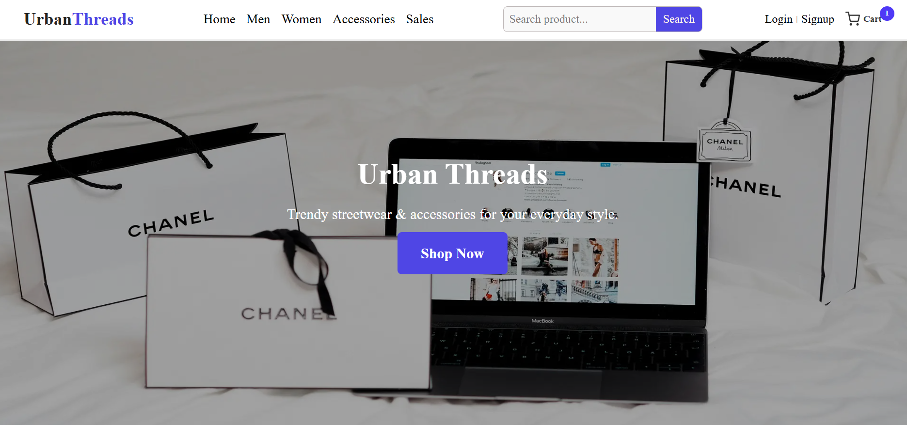
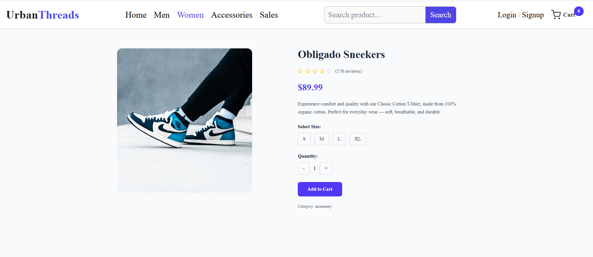

# 🛍️ Urban Threads – Modern E-Commerce Store

A responsive e-commerce web application built with **Next.js**, **TypeScript**, and **Tailwind CSS**.  
It features dynamic product listings, filtering, authentication, and a clean modern UI.

---

## 🚀 Features
- 🛒 Product listing, filtering, and category pages  
- 🔍 Search functionality  
- 👤 User authentication (signup/login)  
- 💬 Newsletter subscription  
- 💳 Cart and checkout pages  
- 📱 Fully responsive design  

---

## 🧠 Tech Stack
- **Frontend:** Next.js, TypeScript, React Context API  
- **Styling:** Tailwind CSS  
- **Backend:** Node.js 
- **Database:** PostgreSQL / MongoDB  
- **Tools:** Git, GitHub, Vercel

---

## 🖼️ Screenshots

### 🏠 Homepage


### 🏠 Product Listing page


### 🏠 Product Detail page



_Add 2–3 nice screenshots or GIFs here — home page, product page, cart page._

---

## ⚙️ Installation & Setup
```bash
# Clone this repository
git clone https://github.com/yourusername/urban-threads.git

# Navigate into the project folder
cd urban-threads

# Install dependencies
npm install

# Run the development server
npm run dev


Check out our [Next.js deployment documentation](https://nextjs.org/docs/app/building-your-application/deploying) for more details.
